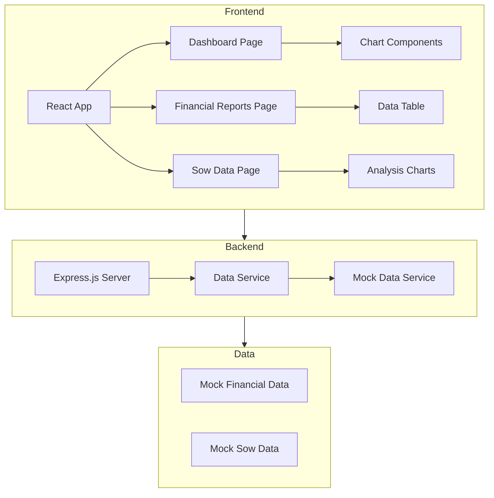
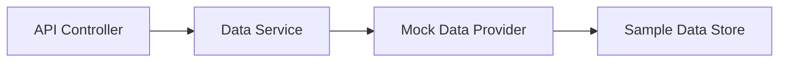
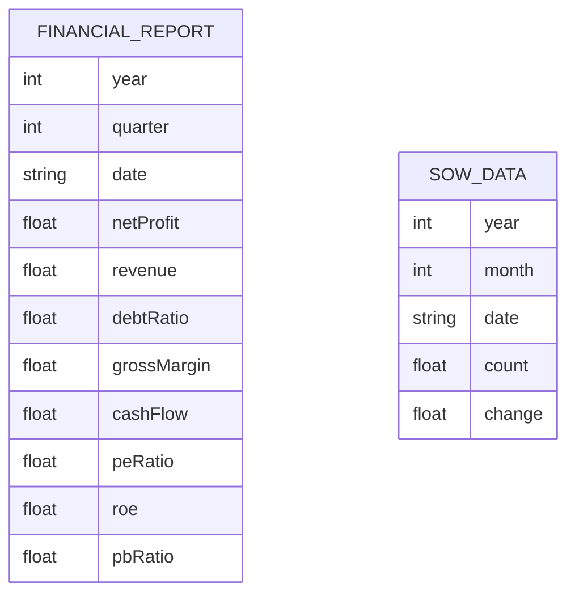

## 1. Architecture Design


## 2. Technology Description
- **Frontend**: React@18 + TypeScript + Tailwind CSS@3 + Vite + Chart.js
- **Initialization Tool**: vite-init
- **Backend**: Express.js@4 + TypeScript
- **Data Storage**: Mock data (with sample historical data)
- **Chart Library**: react-chartjs-2 + chart.js

## 3. Route Definitions
| Route | Purpose |
|-------|---------|
| / | 仪表板主页 - 核心指标概览 |
| /reports | 财报详情页 - 历史财报数据 |
| /sow | 母猪数据页 - 存栏量分析 |
| /api/financial | 获取财务数据 API |
| /api/sow | 获取母猪数据 API |

## 4. API Definitions
```typescript
// Financial Data Types
interface FinancialReport {
  year: number;
  quarter: number;
  date: string;
  netProfit: number; // 净利润 (亿元)
  revenue: number; // 营业收入 (亿元)
  debtRatio: number; // 资产负债率 (%)
  grossMargin: number; // 毛利率 (%)
  cashFlow: number; // 现金流 (亿元)
  peRatio: number; // 市盈率
  roe: number; // 净资产收益率 (%)
  pbRatio: number; // 市净率
}

interface SowData {
  year: number;
  month: number;
  date: string;
  count: number; // 母猪数量 (万头)
  change: number; // 环比变化 (%)
}

// API Responses
interface FinancialResponse {
  success: boolean;
  data: FinancialReport[];
  updatedAt: string;
}

interface SowResponse {
  success: boolean;
  data: SowData[];
  updatedAt: string;
}
```

## 5. Server Architecture Diagram


## 6. Data Model
### 6.1 Data Model Definition


### 6.2 Sample Data Structure
- **Financial Reports**: 2014-2025 年季度数据
- **Sow Data**: 2018-2025 年月度数据
- Data is mock data based on realistic trends for demonstration
