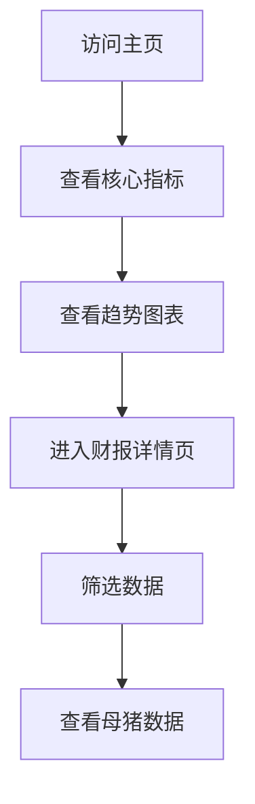

## 1. Product Overview
牧原股份财报数据分析平台，提供自上市以来的完整财务数据展示和分析，包括净利润、营业收入、资产负债率、毛利率、现金流、市盈率、净资产收益率、市净率等核心指标，以及母猪数量波动分析。

## 2. Core Features

### 2.1 Feature Module
1. **仪表板主页**: 核心指标概览、关键数据卡片
2. **财报详情页**: 历史财报数据表格、趋势图表
3. **母猪数据页**: 母猪数量及波动分析

### 2.3 Page Details
| Page Name | Module Name | Feature description |
|-----------|-------------|---------------------|
| 仪表板主页 | 核心指标卡片 | 显示最新财报关键数据，包括净利润、营业收入、ROE等 |
| 仪表板主页 | 趋势图表 | 展示各指标历史趋势线图 |
| 财报详情页 | 财报数据表格 | 按季度/年度展示完整财报数据 |
| 财报详情页 | 数据筛选 | 支持时间范围和指标类型筛选 |
| 母猪数据页 | 母猪数量图表 | 展示母猪存栏量及变化趋势 |

## 3. Core Process
用户访问主页 → 查看核心指标概览 → 点击进入详情页查看历史数据 → 通过筛选和图表进行分析。

## 4. User Interface Design
### 4.1 Design Style
- **Primary Color**: Deep Blue (#1e3a8a) - 专业、稳重
- **Secondary Color**: Teal (#0d9488) - 活力、增长
- **Accent Color**: Amber (#f59e0b) - 强调、警示
- **Background**: Dark theme with subtle gradient (#0f172a → #1e293b)
- **Button Style**: 圆角矩形，微阴影，hover时轻微上浮
- **Font**: Inter 为主，搭配 monospace 显示数字
- **Layout Style**: 卡片式布局，网格系统
- **Icon Style**: 线性图标，简洁现代

### 4.2 Page Design Overview
| Page Name | Module Name | UI Elements |
|-----------|-------------|-------------|
| 仪表板主页 | Hero区域 | 深色背景，公司logo，实时更新指示器 |
| 仪表板主页 | 指标卡片 | 8个数据卡片，网格布局，带趋势箭头 |
| 仪表板主页 | 图表区域 | 双列布局，折线图+柱状图组合 |
| 财报详情页 | 数据表格 | 斑马纹，可排序，悬停高亮 |
| 母猪数据页 | 分析图表 | 面积图展示存栏量，柱状图展示波动 |

### 4.3 Responsiveness
桌面端为主，平板和移动端自适应，采用响应式网格布局，关键内容优先显示。
